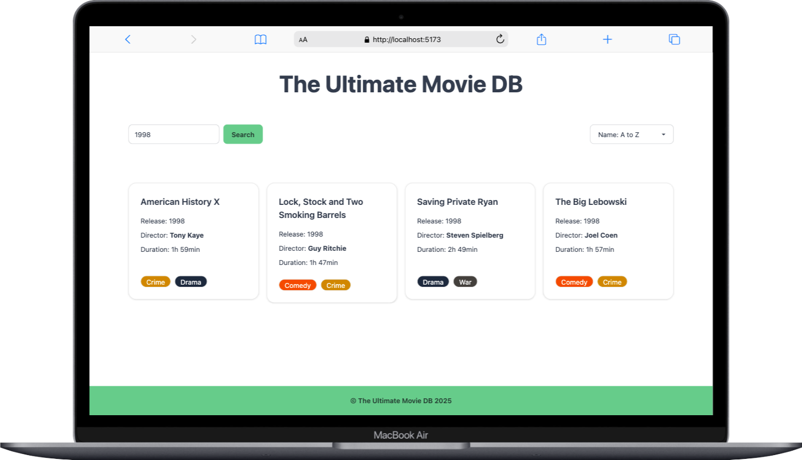
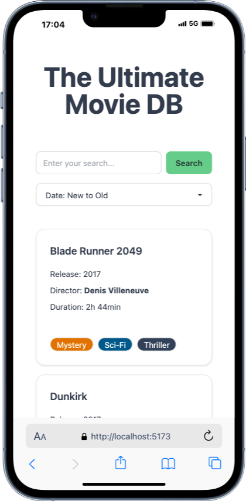

# 🎬 The Ultimate Movie DB 🍿🎥

**The Ultimate Movie DB** is a modern and responsive React + TailwindCSS web application where users can browse a collection of movies, view detailed information, and navigate seamlessly.

> Built in an afternoon as part of my Web Dev bootcamp, Module: React.

---

<p align="center">
  
  
</p>

---

### 🔗 **Live Demo**

➡️ **Check out the project live here:** [The Ultimate Movie DB](https://the-ultimate-movie-db.vercel.app/) 🚀

---

## 🚀 Features

✅ **Home Page** – Displays a grid of movies with quick access to details.  
✅ **Movie Detail Page** – Shows in-depth information about a selected movie, including rating, genres, director, and duration.  
✅ **Search & Sorting** – Users can search for movies and sort them by different criteria (e.g., rating, release year, name).  
✅ **Genre Badges** – Each movie displays its genres using **DaisyUI badges** for better styling.  
✅ **Navigation & Footer** – A clean layout with **DaisyUI buttons and UI components**.

---

## 🛠️ Tech Stack

[](https://reactjs.org/)  
[](https://www.typescriptlang.org/)  
[](https://tailwindcss.com/)  
[](https://daisyui.com/)  
[](https://vitejs.dev/)

---

## 📦 Installation

### 1️⃣ Clone the repository

```sh
git clone git@github.com:jutuli/The-Ultimate-Movie-DB.git
```

### 2️⃣ Install dependencies & start the development server

```sh
npm install
npm run dev
```
